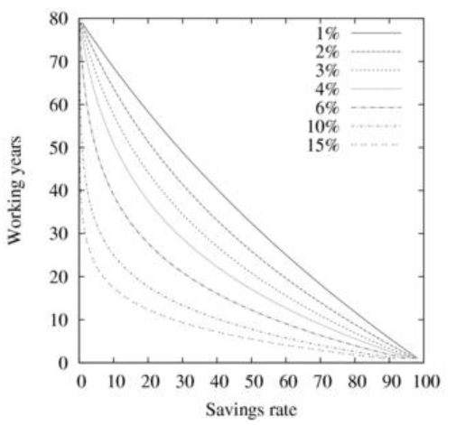

上面的计算没有把投资回报加到账户里。
由于这个原因，如果一个人，以75%的储蓄率，积累了9年的本金，投资回报率是5%，那么这些钱消耗光会多余9年，因为投资收益还没有花掉。
假如投资回报有保证（关于这个稍后详述），那么就可以通过复利i来计算基金到底会持续多久。
假设本金是P₀，每年撤出是p，剩下的钱以利率i按年投资。

那么第一年账户里的钱就会是：

P₁=(P₀-p)+i(P₀-p)=(P₀-p)(1+i)=P₀(1+i)-p(1+i).

另一个p撤出后（现在我们总共撤出了2p），账户里剩余的P₁-c 继续以利率i投资。第二年底账户可以余额就是：

P₂=(P₁-p)(1+i) = P₁(1+i)-p(1+i)

  = (P₀(1+i)-p(1+i))(1+i)-p(1+i)

  = P₀(1+i)²-p(1+i)²-p(1+i)

我们用第一个公式化简掉P₁。重复这个过程，第三年底，账户将会是：

P₃ = (P₂-p)(1+i) = P₀(1+i)³-p(1+i)³-p(1+i)²-p(1+i)

第N年将会是：

PN=P₀(1+i)^N-p(1+i)^N-p(1+i)^N-1-...-p(1+i)²-p(1+i) 
=P₀(1+i)^N-p[(1+i)^N+(1+i)^N-1+...+(1+i)²+(1+i)].

提取方括号里的项是（这里S表示求和）：

S = (1+i)^N+(1+i)^N-1+...+(1+i)²+(1+i),

然后：

(S+1)(1+i) = (1+i)N+1+(1+i)^N+...+(1+i)²+(1+i),

所以，(S+1)(1+i)-S = S+Si+(1+i)-S = Si+(1+i) = (1)+iN+1
就是求和抵消的独立项（如果有怀疑，可以设置N为随机值，然后计算求和结果），推导出：

S = ((1+i)N+1-(1+i))/(i) = ((1+i)((1+i)N-1))/(i).

将[这个公式]()和[这个公式]()代回到[这个公式]()，得到：

PN = P₀(1+i)^N - pS = P₀(1+i)^N-pS 
= P₀(1+i)^N-p((1+i)((1+i)N-1))/(i).

我们感兴趣的是，使用这个公式中，我们的投资组合能持续多久，换句话说，N能多大。当钱耗光时，PN == 0，重写公式：

0 = (P₀)/(p)i-(1+i)(1-1(1+i)^N),

所以N=log[(1)/(1- (P₀)/(p)(i)/(1+i))]/log(1+i)。如果你在求导的过程中睡着了，现在可以起来了，如果我们有一个P₀=10年的本金，每年支出为p=1，利率为4%(i=0.04)，它将持续N=12.38年而不是10年。
作为对比，一个20年的本金参数会持续37.39年。
这很有趣，因为加倍了储蓄以后，在之前的2.38年的基础上，通过10年的利息，又增加了15年。
这个给公式是极早退休的关键公式，所以本章要额外重视！
这个公式将你退休的时间（退休以后你生命持续的时间），关联到你投资组合的大小、投资组合的撤出率p/P₀，展示在这个[表]()中。
注意，这个两个数字互为倒数，如果P₀单位是年，那么p=1年。
这张[图]()展示了这个公式，对于不同的本金和利率i会持续多久。首先，当i=0时，产生了一条直线，因为收不到利息，N年的本金只会持续N年。
另外，如果i = (p/P₀)/(1-p/P₀)，分母为0，然后N趋向无穷。这意味着投资组合会永远持续下去。
这是因为，每年投资组合的增长和撤出的数目相等。这也被叫做永续年金，并且它可以作为永久的成分。
重新整理 i = (p/P₀)/(1-p/P₀)后，得出P₀ = (1+i)p/i，这就是撤出p要求的本金P₀。
永续年金留下了P₀作为遗产。
如果少于撤出p（在这个[公式]()里给出），那么没有撤出的就会被用作增长要素。
这也意味着即使有撤出，P还会增加。

本金大小，给定年限，和它会持续多久和不同的投资利率间的关系图。
积累本金的P₀/p（按你的喜欢以年或者月为单位）的时间，可以用相同的方法计算。
最简单的方法可以用这个[表]()来计算P₀/p=(r)/(1-r)M,
这里r表示储蓄率，M是你工作的时间。
这和生成这个[表]()的公式相同。

现在，如果本金以利率8进行复利投资，我们得到，

P₀/p=(r)/(1-r)SUMi=1M (1+i)i-1

注意，如果i=0，这个公式会简化成上面的[公式]()。
使用相同的技巧处理求和，我们会发现P₀/p=(r)/(1-r)((1+i)^M-1)/(i)。
在传统的个人经济计划中，时间投资M是最重要的因素，这个值通常在30或40年左右。
一些人很聪明，他们可以获取超高的投资回报率i。
我们不计算这个。
在早退休的例子中，M将会很小，并且我们假定i在通常的范围内，可能是6%左右。
这个公式里的主要的就会是r/(1-r)。
对于传统储蓄率 r=0.1来说，杠杆是r/(1-r)=0.11，然而对于极端的储蓄率r=0.75，杠杆是r/(1-r)=3，比之前高27倍！
即使通过很长时间的复利和市场出色的表现，它也很难打败27倍。这张[图]()展示了30年本金不同储蓄率所需要的时间。
根据这张[图]()，即使在3%的回报率下，一个30年的本金会持续70年。
在给定储蓄率，积累P₀/p为30年所需要的时间。
一个可以持续30年的本金，对于绝大多数退休情况都足够安全了。
注意传统15%的储蓄率会让需要的时间多余30年，在给定的10%的平均回报率下。
也就是，如果投资回报率降到保守的6%，就要求超过45年的工作时间。
我们从公式里提取M得到

M =log(1+i(P₀)/(p)(1-r)/(r))/log(1+i)。

假设能活到100岁，一个人要么财务独立，要么在后面的80年里工作（调整这个到你认为合适的时间），那么80=N+M，这里N表示靠积累生活的时间，M表示积累的时间。
我们可以绘出，在回报率i下，工作时间M和储蓄率r之间关系的图线。
这显示在这张[图]()中。这是本章中最重要的[图]()了。
确切地说，它展示了高储蓄率带来极早的财务独立。
相反的，传统建议的储蓄率意味着要工作40年或更多，而且他们非常依赖回报率i。
它也显示了不同储蓄率，例如一般人认为35%很高，和70%储蓄率的不同。
它展示了你的储蓄率和应该退休的年龄M间的关系。
非常清楚的是，一个人如果存3/4的收入，那他5年就可以经济独立！
相反，如果储蓄率为15%，那就要求，即使乐观的6%的回报率，也要工作35年，10%的储蓄率，工作35年，4%的储蓄率，工作45年。

图标显示了储蓄年限在不同投资回报率下的关系，假设一个人能工作的时间是80年，即，20岁开始工作，100岁死。
