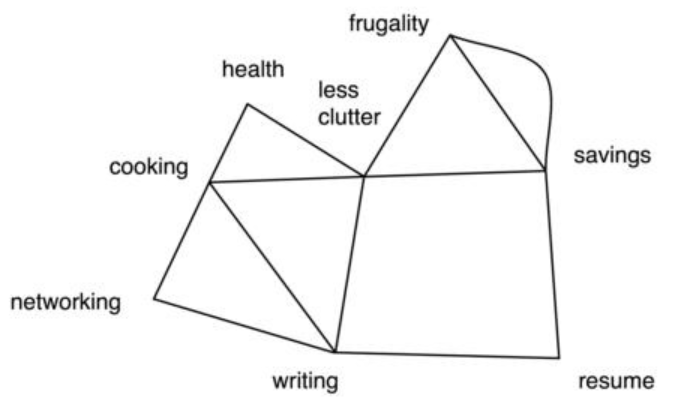

Having thus whittled down the number of available behaviors to a number of
strategies that have mostly--optimally, exclusively--positive benefits, at least to
the  first  order  (but  feel  free  to  continue  the  exercise  to  higher  orders),  it  is
possible to use a simple form of systems thinking to assemble modules for an
overall  strategy.  

通过削减了一系列的可用的行为得到一系列的策略有最多的——可选的，排他的——正向好处，至少在一阶上是这样（但可以轻松的在更高阶上继续练习），这可能是用来组装整体策略的最简单的系统思考形式。

Yet  unlike  the  traditional  approach  to  systems  theory,  which
aims  to  include  an  increasing  amount  of  existing  problems  to  be  solved,
generally  in  a  reactive  fashion,  since  the  previous  lack  of  systems  thinking
created them in the first place, the web of goals strategy aims to solve problems
proactively by creating solutions that could be part of a wider strategy in the
future.

然而不行传统的系统理论那样，它对准的是包含增加一定数量的问题解法，通常在反作用上，因为之前的方法缺少将系统的思考放在第一位，目标网是创建更大的能在未来解决问题的策略。

Another way to think of this is that this strategy maximizes opportunities and
changes  according  to  which  opportunities  bear  fruit. 

另一个思考是这个策略最大化了可能性，并且根据可能性改变。

 It's  an  opportunist's
approach,  which  incidentally  affirms  the  Renaissance  man's  position  in  the
economic and social ecosystem. 

这是一个可能性的途径，这不可避免地影响了文艺复兴人在经济和社会系统中的位置。

Yet another way to think of it is, like the name
suggests, a web that catches, covers, and holds all the individual issues that are
important to the person such as health, wealth, and wisdom.

另一个思考它的方法是，就像名字里提到的，一个捕捉的网，包含对于个人重要的问题，例如健康、财富和智力。

Here is how to build the web: Each module will have one to several goals,
namely the zeroth-and first-order effects of this figure. 

这里是如何构建这个网络：每个模块都有多个目标，由这个图中的零阶和一阶影响命名。

Here I just ignore higher
order goals because their impact is typically small. 

这里我忽略了高阶目标，因为它们的影响通常很小。

Suppose the simple living
module  has  "frugality,"  "savings,"  and  "less  clutter"  as  goals. 

假设一个简单的生活模块由“节俭”，“储蓄”，和“减少混乱”作为目标。

 These  form  a
triangle  in  the  figure. 

这在图中就形成了一个三角形。

 Now  consider  the  career module  which  has  "savings,"
"less clutter" due to being engaged in the career rather than buying rewards for
suffering through a job, "resúmé-building," and "writing skills." 

现在思考一个职业的模块，它由“储蓄”，“减少混乱”因为职场参与受苦而要买些东西作为补偿，“简历构建”，和“写作技能”。

Those are four goals. This forms a square.

这就有了四个目标。它们形成了一个方形。

 The square shares two goals with the triangle, so
draw  them  next  to  each  other. 

方形和三角形有两个共同的目标，所以把它们挨着画。

 Now  add  the  exercise module.  
 
现在增加锻炼模块。
 
 If  bodyweight
exercises are picked, the goals would be "less clutter," "health," and "healthy
cooking." 

如果是体重的锻炼，目标会是“减少混乱”，“健康”和“健康的饮食”。

"Less clutter" already exists, so tag this triangle onto that point.

“减少混乱”已经存在了，不这个标签贴到那个点上。

 The
financial independence module has "frugality" and "savings" as goals. 

经济独立的模块有“节俭”和“储蓄”作为目标。

Tag this
module onto the others by draw a half-circle. 

画个半圆把这个目标重合到其他上。

Add a "hobby" module, say healthy
cooking and writing about it: "writing skills," "networking," and "cooking."

增加一个“爱好”的模块，说它是健康的饮食和写作：“写作技能”，“人际网络”和“厨艺”。

 This
was just an example of a web--now make your own. It may be difficult to draw a
sturdy web--however, take comfort if your goals are limited in quantity and you
can find many activities (modules) that involve several of them. 

这只是一个网的例子——现在绘制你自己的网。绘制一个完整的网这可能是很困难的，然而，如果你的目标是有限的数量你会感到舒适，并且你能找到很多涉及它们活动（模块）。

Like in object-
oriented  programming,  naming  the  concepts  can  be  the  hardest  part  of  this
exercise.

像面向对象编程，命名概念是这个练习里最难的部分。

Interconnected goal structure. Each square, triangle, or semi-circle
represent a distinct modularized activity. 

连上目标结构。每个方块，三角形或是半圆都表示者一个可模块化的活动。

If one goal fails, the tensegrity will
pull and refocus the remaining goals with little shock to the entire system.

如果一个目标失败了，张力会把其余的目标收缩并对整个系统产生一点震动。

Similarly, each link could be thought of as a skill, or alternatively, each
triangle could be thought of as a skill set.

通用的，每个连接可以被想象成是一个技能，或者每个三角可以被认为是一个技能集。

