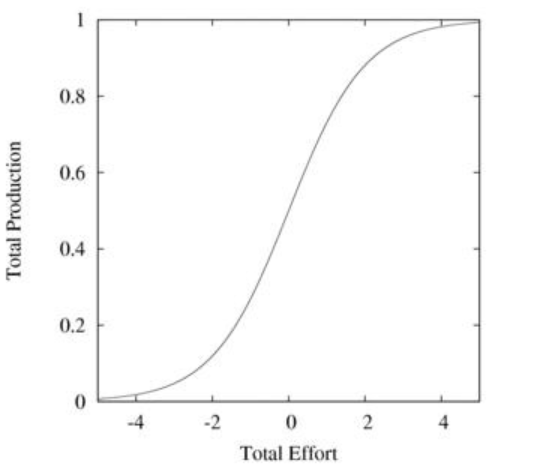
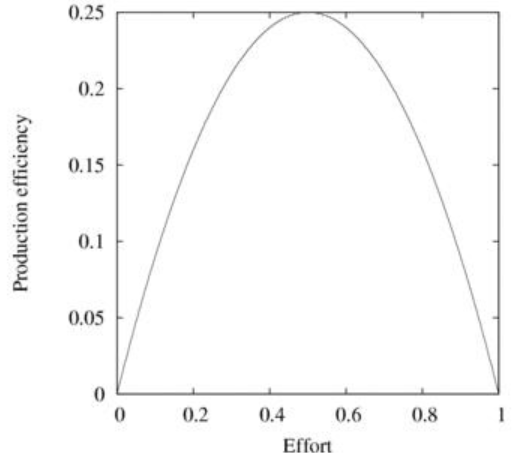

One popular psychological strategy is to set small goals or start slowly. 

一个流行的心理策略是设置一个小目标或者缓慢地开始。

Slow
change  is  comfortable  change. 

缓慢的改变是舒适的改变。

 However,  the  cynic  may  observe  that  with  an
eternal  series  of  baby  steps,  nothing  much  actually  changes.  

然而，从悲观者角度区观察，随着一系列的婴儿蹒跚，事实上什么都没有改变。

This  strategy
usually  fails  from  the  lack  of  meaningful  progress  despite  having  achieved
several  small  goals.53 

这个策略经常因为依赖获取一系列小目标，缺乏有意义的进展而失败。

 There's  a  good  reason  for  this. 
 
这是一个好的原因。

  The  S-curve or  logistic
function shown in this figure is a useful model to explain why this strategy rarely
brings the intended results.

S型曲线或者逻辑韩式如下图所示，是一个有意义的模型，这解释了为什么这个策略很少带来预期的结果。

This figure shows a sigmoid s-curve which can be used as a model to
describe "return on effort" in terms of "effort" for many different kinds of
"effort." 

这个图展示了一个S型的曲线，经常用于描述“投入和产出”模型，这里的“投入”代表着很多不同类型的“投入”。

For example, "return on effort" could be happiness and "effort"
could be salary. 

例如，“产出”可以是幸福，“投入”可以是薪水。

Note that the curve is symmetric around the origin and that
its rate of change is fastest at the origin.

注意到曲线在原点处是对称的，并且在原点处的变化率是最快的。

Here the vertical axis describes the "return on effort" and the horizontal axis
describes  the  "effort." 

纵轴代表“产出”，横轴代表“投入”。

 Here  "effort"  measures  some  kind  of  input  and  return
measures some kind of output. 

这里的“投入”衡量了某种输入，“产出”衡量了某种输出。

For example, the input could be time and the
output could be money. 

例如，输入可以是时间，输出可以是金钱。

The input could also be work and the output could be
happiness, fitness, etc.

输入可以是做事情，输出可以是幸福，苗条等等。

For  the  sake  of  discussion,  let's  consider  a  variable  P  and  think  of  it  as
"Production." 

为了方便讨论，我们定义一个变量P代表“产出”。

One way of thinking about P would be in terms of the cumulative
number of pages I have written as the book project has progressed. 

一种思考P的方法是我已经写作的本书的页数。

The increase
in production is proportional to the current production, because having already
written  and  thought  about  the  subject  makes  it  easier  to  write  more  about  it.

产出的增加是和当前的产出相关联的，因为已经写了这么多，就会认为再多写一些会很容易。

However,  the  increase  in  production  is  also  proportional  to  the  potential  for
further  production. 

然而，增加产出也会关联到将来的产出。

 In  the  beginning,  this  potential  is  high  because  there  are
many things left to write about, but as the book gets closer to the end, there are
fewer topics to write about and so it becomes harder to just pick one and write
about it. 

最开始，这个斜率非常高，因为太多东西还没有写，但是随着写作接近尾声，就没有多少话题可写，因此再多写一些就会变得非常困难。

Here is a simple equation which summarizes this paragraph:54

这段文字可以用这个简单的公式进行总结：

(dP)/(dE)=P(1-P)

What it says is that with few resources (when P on the right-hand side is low
corresponding to the lower left side of the figure and P(1-P)~P), the ability to
change will be proportional to the resources. 

这说的是，当只有很少的资源（当P在右手边很低代表着图中左下角和P(1-P)~P），潜在的变化是指向资源的。

This works like compound interest
and it'll create exponential growth.

这像是复利的工作模式，它会创造指数型增长。

 However, compound interest in itself never
made anyone rich. 

然而，复利本身不会让任何人富有。

Invest $1 at 8% and wait 30 years to get $10. 

按8%的利率投资1刀然后等待30年只会获得10刀。

This is hardly a
worthwhile sum for 30 years of waiting.

这30年的等待是不值得的。

 But invest $100,000 at 8% for 30 years
and  you  get  $1,000,000.  

但是按8%的利率投资10万刀然后等待30年只会获得100万刀。

That  is  real  money. 

这是真正的钱。

 To  get  anywhere,  it's  thus  very
important  to  quickly  build  a  substantial  foundation. 

为了到达任何地方，快速建立一个实质性的基础是非常重要的。

 Setting  small  goals  in  a
situation which depends on exponential growth is a guaranteed way of not seeing
results very fast. 

在依赖指数增长的情况下，设置一个小目标绝对不会看见结果快速变化。

Conversely, putting in a large initial effort is a guaranteed way
of  seeing  immediate  and  growing  returns. 

相反的，投入一个大量的初始值是立马看到回报增长的保证。

 The  middle  of  the  curve  shows  a
proportional relationship between effort and results--work more and get more
results; 

曲线的中间是投入和回报的比例式关系——做的越多回报越多。

work less and get fewer results. 

做的少回报就少。

In other words, this is the stage where
extra effort is rewarded more than it was in the beginning, because it's leveraged
by the now higher production.

换句话说，这个阶段额外的投入获得的回报要比刚开始时多，因为产出被高产出抬高了。

With further effort, the production ceiling starts to kick in due to limits on
resources, customers, responsibilities, market size, etc. 

继续投入，产出因为资源、消费者、岗位和市场规模受限而触及天花板。

You might have found
yourself  with  a  job  description  that  could  be  done  in  three  hours  a  day  even
though you nominally have to work for eight hours. 

你可能会发现在职位描述里，一个每天三个小时可以完成的工作，你通常需要每天工作八个小时。

If so you know what I mean
about reaching the productivity ceiling. 

如果时这样你就知道触及产出天花板是什么意思了。

In such a situation, it makes little sense
to increase work effort by 25% if the return in productivity only increases by
five percent. 

在这种情况下，减少25%的工作投入如果产出只减少5%，这么做是有意义的。

In such a case it is better to start additional projects, look for more
responsibility, or learn something else. 

在这种情况下最好开始一个额外的项目，寻找更多的职责，或者学习其他东西。

These projects would then each have their
own curve for you to progress along.

这些项目每一个都会有自己的曲线让你进步。

The optimal life strategy is to maximize total "production" for all the things
you engage in or whatever the curves are measuring--presumably you'd have a
curve for each project and multidimensional returns for each project, where total
utility (see Building blocks) is maximized (see Ecological).

最优化的生活策略是最大化你涉及事物的总“产出”，或者无论什么曲线来衡量——有可能你每个项目都有不同的曲线和多维的回报，这里总的效用（参见构造模块）是最大化的（参见生态学）。

 Pricewise, it would
be  impossible  to  quantify  because  it  would  require  you  to  determine  the
exchange rate between health, money, satisfaction, meaning, etc.

就价值而论，这会是不可能衡量的，因为这会要求你决定健康、金钱、自信、意义等的交换价值。

, some of which
can't be quantified. 

其中的一些是不能被量化的。

Those values can be subjectively determined, though (see
Emotional).
Given  a  finite  effort  (you  only  have  so  many  days  left  to  live)  total
"production" is optimized by maximizing the "return on effort" for each project.

这些值可以被具体化地确定（参见情绪）。给定一个有限的投入（你只剩下这么多天可活了），通过每个项目的最大化“投入产出”来优化总的产出。

That  is  a  key  statement  and  is  related  to  the  maximum  power  principle  of
ecology. 

这是关键的一段，并且这和生态学上的最大能量原则相关。

What this means is that effort must be distributed between projects for
maximum return on total effort. Put in the effort where the yield is highest. 

这就意味着项目间的投入必须相互贡献以获得最大的总产出。把精力投入到能产出最高的地方。

The
yield is highest where the marginal increase of the return relative to the marginal
increase of effort is the highest.

产出的最高点在投入回报比的最高点。

 In mathematical terms, this occurs where the
derivative of the equation above is 0, that is,

在数学项上，这出现在公式导数为0的时候，也就是，

(d)/(dP)(dP)/(dE)=(d)/(dP)[P(1-P)] = 1-2P = 0 => P = (1)/(2)

This means that the maximum return happens in the middle of the curve.

这意味着最大的回报发生在曲线的中间。

This becomes obvious if we plot dP/dE, which is shown in this figure. 

如果我们绘制出 dP/dE的突现就更明显了。

This has a
lot  of  bearing  on  the  discussion  of  decoupling  in  Decoupling  and  increasing
complexity. 

这和在解耦和增加复杂度章节讨论的有很多的关联性。

In particular, the dynamic region is in the middle of this figure and
this figure.

特别的，动态区域在[这个图](../img/7-c-iv-a-fig1.png)和[这个图](../img/7-c-iv-a-fig2.png)的中间。

 The instant response, which requires 100% effort, is to the right and
the static (no) response, which requires 0% effort, is to the left.

瞬时响应，要求100%的投入，在右边，无响应，要求0%的投入，在左边。

A curve relating additional reward to additional effort.

一个附加投入和附加回报的关联曲线。

To give an example, professionals are often encouraged to hyperspecialize,
that is to put in maximum effort so that they'll achieve maximum production
(upper right of this figure), to win the competition with other professionals and
attract the highest salary. 

例如，专业人士经常被鼓励要更专业，也就是尽最大投入来获取他们的产出（在图中的右面），来赢得和其他专业人士的竞争并获得高薪水。

If money is the only utility that matters, this is the
optimal strategy. 

如果金钱是唯一有意义的东西，那这就是最优的策略。

If, however, happiness, low stress, leisure time, or other things

in the work-life balance also matter, it would result in a different strategy, since
the last, say 80% of the effort, to gain the last 20% of the results, would be
wasted.

如果，幸福、低压力、闲暇时间和其他工作生活平衡的东西也有意义，那结果就是不同的策略了，至少说，80%的投入，来换取最少的20%的回报是浪费。

 Once you understand the maximum power principle intuitively, it'll be
quite  easy  to  follow. 

一旦你理解了最大能量原则，这就会变得非常容易执行。

 In  the  simplest  terms,  it  says  that  you  can  gain  the
maximum utility by being relatively competent in large numbers of topics by
contributing a nontrivial but fairly small effort. 

最简单的是，你可以在同一项目上关联很多的模块，每个只投入很少的精力来增加最大的效用。

This means that you may gain
more utility by being competent (journeyman level) in 10 different topics than
by spending the same amount of time to become an expert in a single topic.

这意味着为了增加效用每个项目上放置10话题，而不是花相同的时间在同一项目上力图成为专家。

