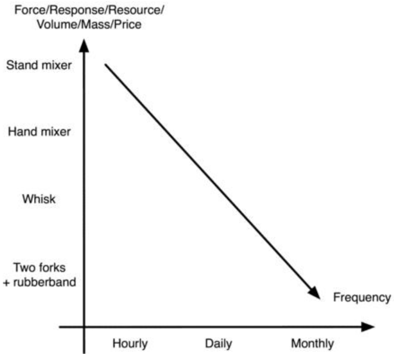

Materialism  has  a  fascination  with  overbuilding,  oversizing,  and
overcompensating. This is bad economics. Consider that for each thing that gets
overbuilt,  there's  something  that  doesn't  get  built.  For  each  thing  that  gets
underbuilt,  there's  something  that  must  be  replaced  when  it  breaks.  Both
problems mean that resources are wasted.
Resources are wasted when the response is not appropriate for the situation.
Responses can be divided into labor, capital, and management. Many are short
on skill (management) and time (labor), therefore money (capital) is spent to
compensate,  hence  the  existence  of  automatic  egg  boiler  gadgets  and  other
atrocities. What is ignored here is that the opportunity cost in terms of time spent
working (or watching TV) and time not spent learning a skill (such as how to
boil an egg) is often higher than the cost in time to learn to boil an egg in a pot
and actually do it. Indeed, the time savings of gadgets is often overestimated,
while  the  time  needed  to  learn  a  skill  is  equally  often  overestimated.  This  is
particularly  true  since  many  capital  assets  are  just  sitting  around,  serving  no
purpose most of the time (see How to get rid of things).52 Conversely, if a job is
going to be repeated often, it makes sense to buy a labor-saving device. Ignoring
skill for the moment, the simple trade-off between capital and labor suggests an
arrangement such as that in this figure.

This figure shows total cost as a function of rate of use. For instance,
once a month baking warrants a pair of forks tied together, whereas baking
daily warrants a hand mixer. Specifically, anything used less than once a
month warrants improvisation.
Skill serves to shift the line in the figure down and to the left because skill
makes the use of time and capital more efficient. Except at a very high level,
maintaining skill has no cost, so if something is learned once, no further effort is
required. In this case it's sensible to develop a skill to just before the point that it
begins to require maintenance, continued practice--beyond this point, replacing
skill and time with capital assets makes more sense.
The skill component is something that consumers frequently misunderstand.
A skilled response can easily be many times more efficient than an unskilled
response. Conversely, the same ratio doesn't hold in terms of capitalization. For
example, an expensive car won't be much faster than an inexpensive one. In the
example of this figure, a whisk will only be a few minutes slower than a hand
mixer, not counting the time one must work to earn the money for a hand mixer.
Consider the difference between an experienced swimmer and a beginning
swimmer. The former is fast and the latter is slow. This, however, doesn't mean
that the faster swimmer expends much more energy than the slow swimmer. The
experienced swimmer is much much efficient and seemingly glides through the
water,  whereas  the  beginner  is  inefficient  and  struggles  just  to  keep  his  head

afloat. Money-handling skills are very similar. The experienced money handler
knows exactly where and how to spend money to get the maximum out of it. An
unskilled money handler spends money everywhere, too much on some things,
too little on other things, with much going to waste.

